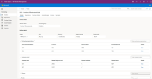

# Stock-Templates-Remastered

Microsoft Power Apps has several stock templates. We'll dust them off and make sure each of them function properly.

https://github.com/microsoft/Power-Fx
https://drawsql.app/teams/neeseus/diagrams/onboarding-tasks-remastered

| Header 1 | Header 2 | Header 3 |
|----------|----------|----------|
| Cell 1   | Cell 2   | Cell 3   |
| Row 2    | Data     | Data     |

- Book A Room 
- Customer Lookup
- Help Desk
- Leave Request
- My Expenses
- Onboarding Tasks
- Shoutouts
- Training for Office

## Other Templates (App Source)

| Preview | Application | Power App Type |
|----------|----------|
|   | [SAP Procurement](https://appsource.microsoft.com/en-us/product/dynamics-365/powerplatformtemplates.mpa-sapprocurement) | Canvas |

- 

- [Awards and Recognitions](https://appsource.microsoft.com/en-us/product/dynamics-365/powerplatformtemplates.mpa-awardsandrecognitionapp?tab=Overview)
  - [Related](https://appsource.microsoft.com/en-us/product/dynamics-365/powerplatformtemplates.mpa-awardsandrecognitioncopilot?tab=Overview)

